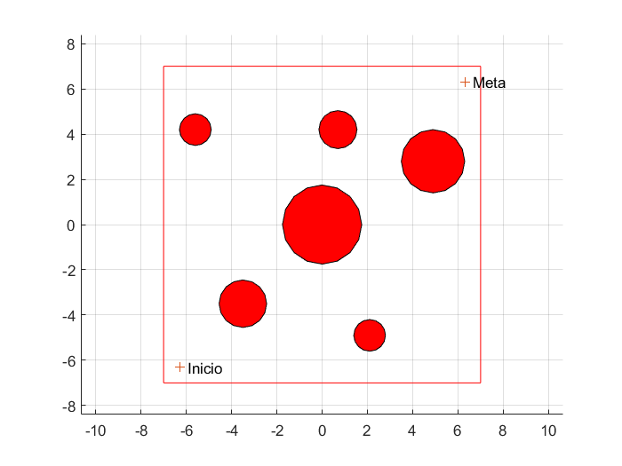

# FRM Navegacion por Campo Potencial

## 🪶Autores
Julian Andres Gonzalez Reina
Emily Angelica Villanueva Serna
Elvin Andres Corredor Torres
## ℹ️Navegacion por Campo Potencial (ROBOT ePuck)
Tarea #3 Fundamentos de Robotica Movil

Para la resolución de esta tarea se buscaron las medidas del robot asignado para poder crear el mapa de obstáculos en Matlab, siendo los siguientes datos los correspondientes al robot e-puck
Diámetro de Ruedas = 41 mm
Distancia entre Ruedas = 53 mm
Diámetro = 70 mm
Altura = 55 mm

Posterior a esto se aplica el algoritmo arena2025.m para obtener el mapa de obstáculos como se ve a continuación.

